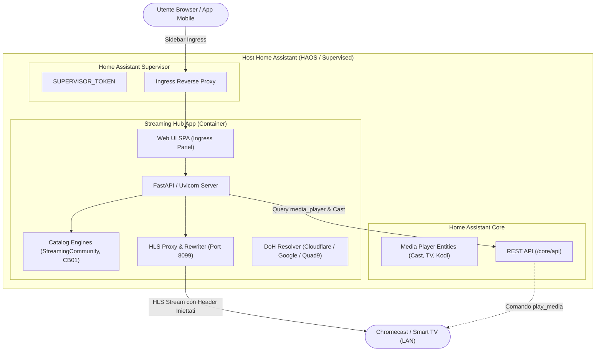

# Home Assistant App Repository: Streaming Hub 🎬🍿

[](https://www.home-assistant.io)
[](LICENSE)
[](https://github.com/JMaroz/ha-streaming-hub)

Repository ufficiale di **Home Assistant App** (Add-on) per **Streaming Hub**: l'hub multimediale per film e serie TV con interfaccia Ingress moderna, proxy di streaming HLS e supporto per il casting verso **Google Cast**, **Android TV** e **Smart TV**.

---

## 📱 Informazioni sull'App

**Streaming Hub** trasforma la tua istanza di Home Assistant in un centro multimediale cinematografico:

- 📺 **Interfaccia Web Ingress Moderna**: Pannello laterale elegante in stile Netflix/Stremio con locandine in alta risoluzione, trame, ricerca istantanea e schede per stagioni ed episodi.
- ⚡ **Player Integrato HLS.js**: Guarda film e serie TV direttamente dal browser del PC o dall'app mobile di Home Assistant.
- 📡 **Casting su Dispositivi Fisici**: Trasmetti con un solo click a qualsiasi dispositivo **Chromecast**, **Google TV**, **Android TV** o **Smart TV** scoperto da Home Assistant.
- 🛡️ **Stream Proxy con Iniezione Header**: Riscrive le playlist HLS (`.m3u8`) e inoltra i chunk video con gli header HTTP richiesti (`Referer`, `Origin`, `User-Agent`), evitando l'errore `403 Forbidden` sui dispositivi Cast fisici.
- 🌐 **Risoluzione DoH (DNS-over-HTTPS)**: Supporto per Cloudflare, Google e Quad9 per garantire la raggiungibilità dei provider anche in caso di restrizioni o censure DNS operatore.
- 🎨 **Metadati Arricchiti**: Integrazione automatica con l'API TMDb e fallback pubblico gratuito (Cinemeta / TVmaze) per trame, sfondi e voti.

---

## 📦 Installazione in Home Assistant

Segui questi semplici passaggi per installare l'App:

1. In Home Assistant, vai su **Impostazioni** > **Componenti aggiuntivi (App)** > **App Store**.
2. Clicca sui **tre puntini in alto a destra** e seleziona **Repository**.
3. Incolla l'URL di questo repository:
   ```text
   https://github.com/JMaroz/ha-streaming-hub
   ```
4. Clicca su **Aggiungi** e poi su **Chiudi**.
5. Cerca **Streaming Hub** nell'elenco delle app disponibili e cliccaci sopra.
6. Clicca su **Installa**.
7. Una volta completata l'installazione, attiva l'opzione **Mostra nella barra laterale** e clicca su **Avvia**.
8. Clicca su **Streaming Hub** nella barra laterale di Home Assistant per aprire l'interfaccia!

---

## ⚙️ Configurazione (Architettura BYOS)

**Streaming Hub** adotta un'architettura **BYOS (Bring Your Own Sources)**: non include né distribuisce link o contenuti predefiniti. L'utente inserisce i propri indirizzi web nella scheda **Configurazione** dell'App:

```yaml
log_level: info
custom_sources:
  - url: "https://tuo-indirizzo-sorgente.esempio"
    type: "auto"
custom_dns: cloudflare
tmdb_api_key: ""
stream_port: 8099
```

### Parametri di Configurazione

| Parametro | Tipo | Predefinito | Descrizione |
|---|---|---|---|
| `log_level` | list | `info` | Livello di log dell'app (`trace`, `debug`, `info`, `warning`, `error`). |
| `custom_sources` | list | `[]` | Array di sorgenti web dell'utente. Il tipo può essere `auto`, `streamingcommunity` o `cb01`. |
| `custom_dns` | list | `cloudflare` | Provider DNS-over-HTTPS (`cloudflare`, `google`, `quad9`, `system`). |
| `tmdb_api_key` | string | `""` | *(Opzionale)* Chiave API TMDb per locandine HD e trame arricchite. |
| `stream_port` | port | `8099` | Porta proxy HTTP per lo streaming nella rete locale (LAN). |

---

## 🏛️ Architettura del Progetto



---

## 📂 Struttura del Repository

```text
ha-streaming-hub/
├── repository.yaml             # Manifest del repository di App per Home Assistant
├── README.md                   # Documentazione principale
├── .github/workflows/          # CI/CD GitHub Actions (Lint, build)
├── docs/                       # Piani di migrazione e architettura
└── streaming_hub/              # Home Assistant App
    ├── config.yaml             # Specifiche App (Ingress, Host Network, API Token)
    ├── build.yaml              # Multi-arch build da base-python di Frenck
    ├── Dockerfile              # Dockerfile con FFmpeg e Python
    ├── DOCS.md                 # Documentazione integrata in HA App Store
    ├── icon.png                # Icona dell'App
    ├── logo.png                # Logo banner dell'App
    ├── requirements.txt        # Dipendenze Python
    ├── translations/           # Traduzioni per le opzioni (Italiano, Inglese)
    ├── rootfs/                 # Setup s6-overlay v3 con script Bashio
    ├── backend/                # Server FastAPI asincrono
    │   ├── main.py             # Router REST e Ingress handler
    │   ├── ha_client.py        # Client Home Assistant Core via SUPERVISOR_TOKEN
    │   ├── streamingcommunity.py # Scraper e resolver StreamingCommunity
    │   ├── cb01_client.py      # Scraper e client CB01
    │   ├── parser.py           # Parser HTML
    │   ├── proxy.py            # Proxy HLS e riscrittura playlist M3U8
    │   ├── dns_resolver.py     # Resolver DNS-over-HTTPS (DoH)
    │   ├── metadata.py         # Arricchitore TMDb / Cinemeta
    │   ├── models.py           # Modelli Movie, TvSeries, Episode, Source
    │   ├── utils.py            # Deduplicazione e unificazione cataloghi
    │   └── providers/          # Adapter per provider video (SC, Maxstream, Mixdrop)
    └── frontend/               # Single Page Application
        ├── index.html          # Interfaccia grafica principale
        ├── css/style.css       # Stili cinematici dark mode con glassmorphism
        └── js/                 # Logica UI e player HLS.js
            ├── app.js
            └── hls.min.js
```

---

## 📄 Licenza

Rilasciato sotto licenza [MIT](LICENSE).
