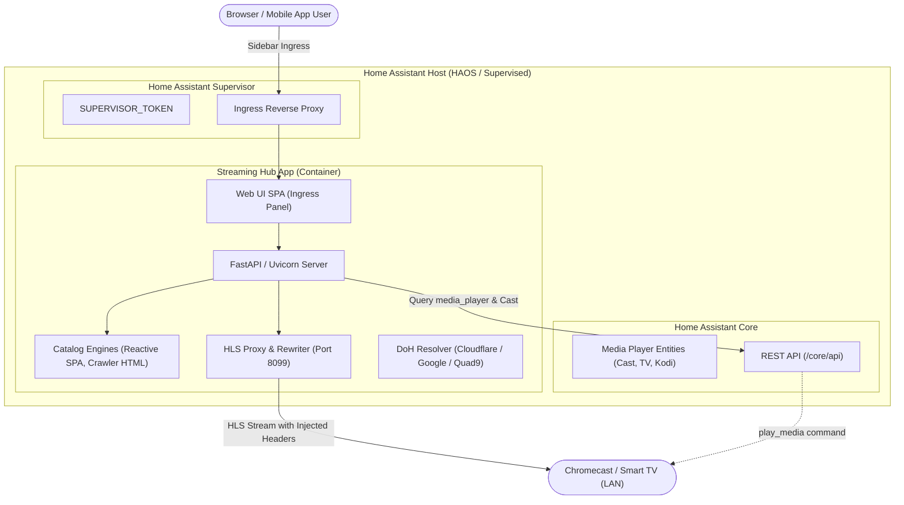

# Home Assistant App Repository: Streaming Hub 🎬🍿

[](https://www.home-assistant.io)
[](LICENSE)
[](https://github.com/JMaroz/ha-streaming-hub)

Official **Home Assistant App** (Add-on) repository for **Streaming Hub**: your ultimate media hub for movies and TV series. Featuring a modern Ingress interface, HLS streaming proxy, and seamless casting support for **Google Cast**, **Android TV**, and **Smart TVs**.

---

## 📱 Features

**Streaming Hub** transforms your Home Assistant instance into a cinematic media center:

- 📺 **Modern Ingress Web UI**: An elegant, Netflix/Stremio-style side panel featuring high-resolution posters, plot summaries, instant search, and dedicated tabs for seasons and episodes.
- ⚡ **Integrated HLS.js Player**: Watch your favorite movies and TV series directly from your PC browser or the Home Assistant mobile app.
- 📡 **Universal Casting**: 1-click casting to any **Chromecast**, **Google TV**, **Android TV**, or **Smart TV** discovered by Home Assistant on your local network.
- 🛡️ **Stream Proxy & Header Injection**: Intelligently rewrites HLS playlists (`.m3u8`) and forwards video chunks with necessary HTTP headers (`Referer`, `Origin`, `User-Agent`), completely bypassing `403 Forbidden` errors on physical Cast devices.
- 🌐 **DoH (DNS-over-HTTPS) Resolution**: Built-in support for Cloudflare, Google, and Quad9 ensures provider reachability even against ISP-level DNS censorship or restrictions.
- 🎨 **Enriched Metadata**: Automatic integration with the TMDb API, featuring a free public fallback (Cinemeta / TVmaze) for rich plots, background art, and ratings.

---

## 📦 Installation in Home Assistant

Get up and running in just a few clicks:

1. In Home Assistant, navigate to **Settings** > **Add-ons** > **Add-on Store**.
2. Click the **three dots in the top right corner** and select **Repositories**.
3. Paste the URL of this repository:
   ```text
   https://github.com/JMaroz/ha-streaming-hub
   ```
4. Click **Add** and then **Close**.
5. Search for **Streaming Hub** in the add-on store and select it.
6. Click **Install**.
7. Once installed, toggle **Show in sidebar** and click **Start**.
8. Click on **Streaming Hub** in your Home Assistant sidebar to open the cinematic UI!

---

## ⚙️ Configuration (BYOS Architecture)

**Streaming Hub** embraces a **BYOS (Bring Your Own Sources)** architecture: it does not include or distribute default links or content. Users configure their own web sources directly in the Add-on's **Configuration** tab:

```yaml
log_level: info
custom_sources:
  - url: "https://your-source-url.example"
    type: "auto"
custom_dns: cloudflare
tmdb_api_key: ""
stream_port: 8099
```

### Configuration Parameters

| Parameter | Type | Default | Description |
|---|---|---|---|
| `log_level` | list | `info` | Application log level (`trace`, `debug`, `info`, `warning`, `error`). |
| `custom_sources` | list | `[]` | Array of your custom web sources. Type can be `auto`, `reactive`, or `crawler`. |
| `custom_dns` | list | `cloudflare` | DNS-over-HTTPS provider (`cloudflare`, `google`, `quad9`, `system`). |
| `tmdb_api_key` | string | `""` | *(Optional)* Global fallback TMDb API key. |
| `stream_port` | port | `8099` | HTTP proxy port for streaming on the local network (LAN). |
| `profiles` | list | `[...]` | Family Account profiles with age filters (`ALL`, `18+`, `14+`, `6+`, `T`), and individual TMDb/Trakt credentials. |

### Family Accounts & Profiles

Streaming Hub supports multiple profiles to keep everyone's preferences separate and safe:
- **Age Rating Filters**: Restrict visible content based on classifications (`ALL`, `18+`, `14+`, `6+`, `T`).
- **Isolated Watchlists**: Separate *Continue Watching*, *Favorites*, and *Watched* lists per profile.
- **Personalized Integrations**: Each profile can have its own TMDb key and Trakt.tv credentials for real-time playback scrobbling.
- **Netflix-Style Switcher**: Quick profile switching via the header pill or the *"Who's watching?"* modal.

```yaml
profiles:
  - id: "dad"
    name: "Dad"
    avatar: 1
    rating_filter: "ALL"
    tmdb_api_key: "tmdb_key_1"
    trakt_client_id: "trakt_client_id_1"
    trakt_access_token: "trakt_token_1"
  - id: "kids"
    name: "Kids"
    avatar: 4
    rating_filter: "6+"
```

---

## 🏛️ Project Architecture


```mermaid
flowchart TD
    subgraph Host["Home Assistant Host (HAOS / Supervised)"]
        subgraph Supervisor["Home Assistant Supervisor"]
            ST["SUPERVISOR_TOKEN"]
            ING["Ingress Reverse Proxy"]
        end

        subgraph Core["Home Assistant Core"]
            MP["Media Player Entities (Cast, TV, Kodi)"]
            API["REST API (/core/api)"]
        end

        subgraph App["Streaming Hub App (Container)"]
            UI["Web UI SPA (Ingress Panel)"]
            BE["FastAPI / Uvicorn Server"]
            Scraper["Catalog Engines (Reactive SPA, Crawler HTML)"]
            Proxy["HLS Proxy & Rewriter (Port 8099)"]
            DoH["DoH Resolver (Cloudflare / Google / Quad9)"]
        end
    end

    User(["Browser / Mobile App User"]) -->|Sidebar Ingress| ING --> UI
    UI --> BE
    BE --> Scraper
    BE --> Proxy
    BE -->|Query media_player & Cast| API
    Proxy -->|HLS Stream with Injected Headers| CastDevice(["Chromecast / Smart TV (LAN)"])
    API -.->|play_media command| CastDevice
```

---

## 📂 Repository Structure

```text
ha-streaming-hub/
├── repository.yaml             # Home Assistant Add-on repository manifest
├── README.md                   # Main documentation
├── .github/workflows/          # GitHub Actions CI/CD (Lint, build)
├── docs/                       # Migration plans and architecture docs
└── streaming_hub/              # Home Assistant App
    ├── config.yaml             # App specs (Ingress, Host Network, API Token)
    ├── build.yaml              # Multi-arch build config
    ├── Dockerfile              # Dockerfile featuring FFmpeg and Python
    ├── DOCS.md                 # Integrated docs for HA Add-on Store
    ├── icon.png                # App Icon
    ├── logo.png                # App Logo Banner
    ├── requirements.txt        # Python Dependencies
    ├── translations/           # Config UI translations (EN, IT)
    ├── rootfs/                 # s6-overlay v3 setup with Bashio scripts
    ├── backend/                # Async FastAPI Server
    │   ├── main.py             # REST router and Ingress handler
    │   ├── ha_client.py        # HA Core client via SUPERVISOR_TOKEN
    │   ├── engine_reactive.py  # Client/resolver for reactive SPA engines
    │   ├── engine_crawler.py   # Client for HTML crawler engines
    │   ├── crawler_parser.py   # HTML parser for semantic catalogs
    │   ├── proxy.py            # HLS Proxy & M3U8 Playlist rewriter
    │   ├── dns_resolver.py     # DNS-over-HTTPS (DoH) resolver
    │   ├── metadata.py         # TMDb / Cinemeta metadata enricher
    │   ├── models.py           # Movie, TvSeries, Episode, Source models
    │   ├── utils.py            # Catalog unification and deduplication
    │   └── providers/          # Video provider adapters
    └── frontend/               # Single Page Application
        ├── index.html          # Main UI
        ├── css/style.css       # Cinematic dark mode with glassmorphism
        └── js/                 # UI logic and HLS.js player
            ├── app.js
            └── hls.min.js
```

---

## 📄 License

Released under the [MIT License](LICENSE).
