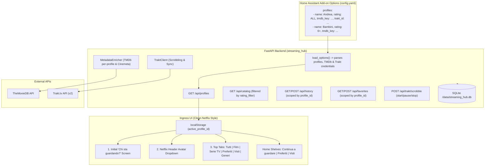

# Implementation Plan: Family Accounts, Content Filtering, Trakt.tv & TMDb Integration

## Goal Description
Implement a complete **Family Account & Profiles** architecture in Streaming Hub with:
1. **Per-Profile Configuration**:
   - Profile **Name** & **Content Rating / Classification Filter** (`ALL`, `18+`, `14+`, `6+`, `T`).
   - Individual **TheMovieDB (TMDb) API Key** per person.
   - Individual **Trakt.tv API Client ID & Access Token** per person (following [Trakt API Getting Started](https://docs.trakt.tv/docs/getting-started)) for automatic playback scrobbling and cloud history sync.
2. **Streamlined UI Navigation (No Lateral Drawer)**:
   - **Horizontal Shelves on Home Page**:
     - *Continua a Guardare* (Iniziati / In Progress with % indicator)
     - *I tuoi Preferiti* (Favorites carousel with fast unpin/play)
     - *Visti di Recente* (Completed / Watched carousel to quickly re-watch or browse)
   - **Top Navigation Tabs alongside Film & Serie TV**:
     - `Tutti` | `Film` | `Serie TV` | `Preferiti` | `Visti` | `Generi ▾`
     - Direct access to complete grids for Favorites and Watched titles.
3. **Netflix-Style Profile Switching**:
   - **First App Open / Initial Session**: Fullscreen *"Chi sta guardando?"* (Who's watching?) modal with avatar tiles.
   - **Header Dropdown**: Netflix-style avatar pill in the top navbar with active profile, instant 1-click switcher, and direct shortcuts to Favorites / Watched / Settings.
4. **Home Assistant Add-on Configuration**:
   - Profiles configured in Home Assistant Add-on options (`config.yaml`), automatically loaded by the backend without requiring separate external databases.

---

## User Review Required

> [!IMPORTANT]
> **Configuration Schema Evolution (`config.yaml`)**:
> - `tmdb_api_key` and new `trakt_client_id` / `trakt_access_token` are configured **per profile** in the `profiles` array.
> - Backward compatibility: If an existing user has a top-level `tmdb_api_key` or no `profiles` configured, a default profile ("Principale") is automatically generated inheriting the key.
> - Profiles without personal TMDb/Trakt keys fall back gracefully to the global key or public Cinemeta/TVmaze metadata without errors.

> [!WARNING]
> **Database Schema Migration**:
> SQLite tables (`watch_history` and `favorites`) will be migrated safely:
> 1. Add `profile_id TEXT NOT NULL DEFAULT 'default'` to `watch_history` and `favorites`.
> 2. Add `certification TEXT` to `titles` table.
> 3. Add `trakt_id INTEGER` to `titles` table.
> 4. Ensure composite unique constraints: `(profile_id, media_id)` and `(profile_id, title_id)`.
> Existing user data will be attributed to the default profile without data loss.

---

## Architecture & Data Flow



---

## Detailed Feature Specifications

### 1. Home Assistant Configuration Schema
In `streaming_hub/config.yaml`:
```yaml
options:
  log_level: "info"
  custom_sources: []
  custom_dns: "cloudflare"
  stream_port: 8099
  profiles:
    - id: "default"
      name: "Principale"
      avatar: "avatar_1"
      rating_filter: "ALL"
      tmdb_api_key: ""
      trakt_client_id: ""
      trakt_access_token: ""

schema:
  log_level: "list(trace|debug|info|notice|warning|error|fatal)"
  custom_sources:
    - url: "url"
      type: "list(auto|streamingcommunity|cb01)?"
      name: "str?"
  custom_dns: "list(cloudflare|google|quad9|system)"
  stream_port: "port"
  profiles:
    - id: "str"
      name: "str"
      avatar: "list(avatar_1|avatar_2|avatar_3|avatar_4|avatar_5|avatar_6)?"
      rating_filter: "list(ALL|18+|14+|6+|T)?"
      tmdb_api_key: "str?"
      trakt_client_id: "str?"
      trakt_access_token: "str?"
      pin: "str?"
```

### 2. Trakt.tv API Integration Architecture
Following [Trakt API Documentation](https://docs.trakt.tv/docs/getting-started):
- **Base URL**: `https://api.trakt.tv`
- **Required Headers**:
  - `Content-Type: application/json`
  - `trakt-api-version: 2`
  - `trakt-api-key: <trakt_client_id>`
  - `Authorization: Bearer <trakt_access_token>` (when user authentication is configured)
- **Features**:
  1. **Playback Scrobbling** (`/scrobble/start`, `/scrobble/pause`, `/scrobble/stop`):
     - Automatically notifies Trakt when a user starts watching, pauses, or finishes a movie or episode.
     - When progress is >= 80%, Trakt automatically records the title as watched in the user's Trakt profile.
     - Supports both browser playback and Google Cast playback sessions!
  2. **Device Code Authorization Flow** (`/oauth/device/code` & `/oauth/device/token`):
     - Enables linking a Trakt account directly by entering a short code on `https://trakt.tv/activate`, saving the resulting `access_token` per profile.
  3. **History & Watchlist Sync**:
     - Optional two-way synchronization between Streaming Hub favorites and Trakt watchlist, as well as completed watched titles.

### 3. Content Classification & Rating Filtering
- TMDb returns movie release dates with Italian (`IT`) certifications (`T`, `6+`, `VM14` / `14+`, `VM18` / `18+`) and US ratings (`G`, `PG`, `PG-13`, `R`, `NC-17`).
- The backend normalizes ratings into age limits:
  - `T`: 0+ (Everyone / General)
  - `6+`: 6+ (Kids / Children)
  - `14+`: 14+ (Teens / Young Adults)
  - `18+` / `ALL`: 18+ (Adults / No restriction)
- When a profile with e.g. `rating_filter: "6+"` queries the catalog, search, or genres:
  - Titles rated 14+, 18+, VM14, VM18, R, NC-17, TV-MA are filtered out.
  - Titles without ratings that belong to adult/horror genres are proactively hidden.

### 4. UI Layout & Navigation Design
- **Eliminated Drawer / Sidebar**: Keeps UI clean, uncluttered, and fast.
- **Top Navigation Tabs**:
  - `Tutti` | `Film` | `Serie TV` | `Preferiti` | `Visti` | `Generi ▾`
  - Selecting `Preferiti` filters the main grid to display all saved favorites of the active profile with sorting and count.
  - Selecting `Visti` displays all completed titles for the active profile.
- **Home Screen Carousels (Horizontal Shelves)**:
  - **Continua a guardare (Iniziati)**: In-progress titles with progress bar, remaining time, resume button, and remove (✕) button.
  - **I tuoi Preferiti**: Dedicated horizontal shelf showcasing saved favorites with quick play and details buttons.
  - **Visti di Recente**: Dedicated horizontal shelf displaying finished titles for quick re-watching.
  - **Ultimi Arrivi**: Unified latest catalog grid filtered by active profile rating.
- **Header Profile Dropdown**:
  - Located in the navbar next to the search bar.
  - Shows active avatar and name with a dropdown chevron.
  - On click, opens a Netflix-style menu:
    - List of other family members for instant 1-click switching.
    - Quick links: *"I miei Preferiti"*, *"Film Visti"*, *"Chi sta guardando?"* (re-open picker), and link to HA Configuration.

---

## Proposed Changes

### Component 1: Configuration & Translations
#### [MODIFY] `streaming_hub/config.yaml`
- Add `profiles` list in options & schema with `id`, `name`, `avatar`, `rating_filter`, `tmdb_api_key`, `trakt_client_id`, `trakt_access_token`, `pin`.
#### [MODIFY] `streaming_hub/translations/it.yaml` & `streaming_hub/translations/en.yaml`
- Add labels and descriptions for all profile fields and Trakt credentials.

### Component 2: Trakt Client & Metadata Enrichment
#### [NEW] `streaming_hub/backend/trakt_client.py`
- Create `TraktClient` implementing:
  - Scrobble API (`scrobble_start`, `scrobble_pause`, `scrobble_stop`).
  - Device Code OAuth flow (`get_device_code`, `poll_device_token`).
  - User sync API (`get_watched_history`, `get_watchlist`, `sync_watchlist_item`).
#### [MODIFY] `streaming_hub/backend/metadata.py`
- Query `release_dates` (movies) and `content_ratings` (TV) from TMDb.
- Extract certifications and support per-profile TMDb key.

### Component 3: Database & Models
#### [MODIFY] `streaming_hub/backend/models.py`
- Add `certification` and `trakt_id` fields to `Movie` and `TvSeries`.
- Add `Profile` model with Trakt and TMDb configuration.
#### [MODIFY] `streaming_hub/backend/database.py`
- Run SQLite migrations for `profile_id` on `watch_history` and `favorites`.
- Add `certification` and `trakt_id` columns to `titles`.
- Update all queries to filter by `profile_id`.
- Add `get_watched_history(profile_id, limit)` method.

### Component 4: API Routes & Cast Scrobbling
#### [MODIFY] `streaming_hub/backend/main.py`
- Parse `profiles` with Trakt & TMDb configurations.
- Add `/api/profiles` endpoint.
- Add `/api/trakt/auth/device-code` and `/api/trakt/auth/token` endpoints.
- Update `/api/catalog/...` to accept `profile_id` and apply rating filtering.
- Update `/api/history`, `/api/history/continue`, `/api/history/watched`, and `/api/favorites` to scope by `profile_id`.
- Integrate Trakt scrobbler on progress updates (both browser & Cast).

### Component 5: Frontend UI & Application Logic
#### [MODIFY] `streaming_hub/frontend/index.html`
- Update navbar with `Preferiti` and `Visti` tabs.
- Add Header Profile Dropdown (`#profile-dropdown-wrapper`).
- Add Home page carousels: `#favorites-section` and `#watched-section` alongside `#continue-section`.
- Add "Chi sta guardando?" full-screen modal (`#profile-picker-modal`).
- Add favorite toggle (heart button) on cards and details modal.
#### [MODIFY] `streaming_hub/frontend/css/style.css`
- Add styles for:
  - Header profile dropdown with avatar badge.
  - Horizontal carousels for Favorites and Watched.
  - Netflix-style "Chi sta guardando?" modal with glow and tile hover effects.
  - Heart favorite button with active animation.
#### [MODIFY] `streaming_hub/frontend/js/app.js`
- Implement profile state and switching.
- Render home carousels: Continua a guardare, Preferiti, Visti di recente.
- Handle `activeType = "favorites"` and `activeType = "watched"` in top tabs.
- Connect Trakt scrobbling on player progress.
- Handle favorite toggle with immediate UI response and toasts.

---

## Verification Plan

### Automated Tests
1. Verify database schema initialization and migration:
   ```bash
   python3 -c "import asyncio; from streaming_hub.backend.database import MediaDatabase; db = MediaDatabase(); asyncio.run(db.init())"
   ```
2. Test Trakt API client headers, scrobble payload structure, and URL resolution.

### Manual Verification
1. **Home Assistant Add-on Settings**:
   - Set up profiles with name, avatar, rating filter, TMDb key, and Trakt client ID.
   - Verify profiles load in `/api/profiles`.
2. **Profile Selection**:
   - Verify initial "Chi sta guardando?" screen on first launch.
   - Switch profile from header dropdown with 1 click.
3. **Rating Filter Verification**:
   - In a child profile (e.g. `6+`): verify mature content is filtered out from catalog, search, and continue shelves.
4. **Shelves & Navigation**:
   - Verify Home page displays *Continua a guardare*, *I tuoi Preferiti*, and *Visti di Recente* carousels.
   - Click *Preferiti* tab: verify grid displays all favorite titles.
   - Click *Visti* tab: verify grid displays completed titles.
5. **Trakt Integration**:
   - Play a video: verify Trakt scrobble event is sent with progress and records to Trakt when >= 80%.
6. **Cast Scoping**:
   - Cast from Profile A: verify progress saves to Profile A's continue watching shelf.
