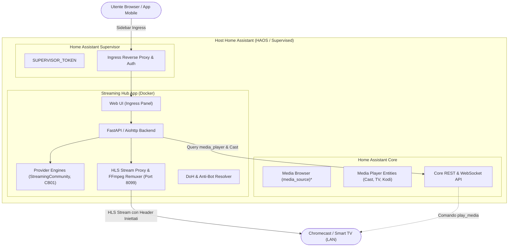

# Implementation Plan: Transizione da Custom Component a Home Assistant App (Streaming Hub)

## Goal Description
Esplorare e pianificare la trasformazione del custom component `cb01` (Streaming Hub) in una **Home Assistant App** (denominazione ufficiale degli Add-on a partire da Home Assistant 2026.2), valutando sia l'opzione **Pure App** (applicazione standalone con Ingress) sia l'opzione **Hybrid Architecture** (App di backend con Ingress + Companion Integration leggera per Media Browser e automazioni, pattern adottato da progetti come *Music Assistant* e *Frigate*).

L'obiettivo è liberare l'event loop di Home Assistant Core dal carico di video proxying, transcoding FFmpeg e scraping web, offrendo al contempo un'interfaccia utente moderna (stile Netflix/Stremio) con player integrato e gestione avanzata dei flussi di streaming e dei captcha.

---

## Template GitHub Ufficiali e di Riferimento
Per la creazione dell'App (Add-on) si consigliano:
- **Template Ufficiale Home Assistant**: [home-assistant/addons-example](https://github.com/home-assistant/addons-example) - Il repository di esempio raccomandato dalla documentazione per sviluppatori di Home Assistant.
- **Template Community Add-ons**: [hassio-addons/addon-example](https://github.com/hassio-addons/addon-example) e [frenck/addon-template](https://github.com/frenck/addon-template) - Per configurazioni avanzate di build multi-architettura, GitHub Actions CI/CD e Ingress.

---

## User Review Required

> [!IMPORTANT]
> **Compatibilità di installazione**:
> Le Home Assistant App (Add-on) sono disponibili nativamente solo su **Home Assistant OS (HAOS)** e **Home Assistant Supervised**. Gli utenti che eseguono Home Assistant Container (Docker puro) o Home Assistant Core (ambiente Python venv) non hanno accesso all'App Store del Supervisor; per loro l'App andrebbe distribuita come normale container `docker-compose`.

> [!WARNING]
> **Rete e Casting ai Dispositivi (Chromecast / Smart TV)**:
> I dispositivi Cast fisici risiedono sulla rete locale (LAN) e **non possono** raggiungere la rete bridge interna di Docker (`172.30.32.x`). Per consentire il casting diretto dei flussi proxati senza errori 403 (mancanza di header Referer/Cookie da parte dei dispositivi Cast), l'App deve:
> 1. Essere configurata con `host_network: true` oppure con mappatura esplicita della porta stream (es. `8099:8099`).
> 2. Costruire URL di streaming basati sull'IP della macchina host Home Assistant (`http://<HA_HOST_IP>:8099/stream/<token>`).

> [!NOTE]
> **Accesso al Cast NON è perso, ma cambia il meccanismo**:
> Un'App non accede a `hass.states` in memoria, ma interagisce con Home Assistant tramite l'API Core protetta da `SUPERVISOR_TOKEN` (`POST http://supervisor/core/api/services/media_player/play_media`). L'App può interrogare le entità `media_player` disponibili e pilotare qualsiasi Chromecast o Smart TV.

---

## Open Questions

> [!IMPORTANT]
> **Scelta dell'Architettura Target**:
> Quale modello di fruizione si intende adottare?
> - **Opzione A — Hybrid Model (Consigliata)**: Creare l'App per backend, proxy video, headless scraping e Ingress UI, mantenendo una versione leggera del Custom Component per continuare a esporre il catalogo nel **Media Browser nativo di HA** (`media_source`), sensori ed entità `select`.
> - **Opzione B — Pure Standalone App**: Trasformare tutto al 100% in App. Il catalogo e il player vivono esclusivamente nel pannello laterale Ingress di Home Assistant. Non viene installato nulla in HACS. Il casting avviene selezionando il dispositivo direttamente dalla UI dell'App.

> [!NOTE]
> **Tecnologia Frontend per l'App**:
> Per la UI Ingress preferiamo un'interfaccia moderna in **React / Vite / Tailwind** (o Vue / Svelte), oppure un'interfaccia renderizzata server-side con Jinja2 / HTMX / Vanilla JS per minimizzare il build tooling?

---

## Architecture Overview



---

## Proposed Changes

La migrazione è strutturata in componenti modulari. L'integrazione esistente in Python contiene già la logica di business principale (`StreamingCommunityClient`, `CB01Client`, `CB01StreamProxy`, `MetadataEnricher`), che può essere riutilizzata come motore dell'App.

### 1. Struttura del Repository App (Home Assistant App Repository)

Creazione della repository o cartella dedicata per l'App di Home Assistant (compatibile con l'App Store locale o pubblico su GitHub).

#### [NEW] `repository.yaml`
Metadati del repository di App per Home Assistant.
```yaml
name: "Streaming Hub Repository"
url: "https://github.com/JMaroz/ha-streaming-hub-app"
maintainer: "JMaroz"
```

#### [NEW] `streaming_hub/config.yaml`
Configurazione dell'App per il Supervisor di Home Assistant.
```yaml
name: "Streaming Hub"
slug: "streaming_hub"
description: "Hub multimediale per film e serie TV con streaming HLS, Ingress UI e supporto Cast"
version: "1.0.0"
arch:
  - aarch64
  - amd64
  - armv7
init: false
homeassistant_api: true
ingress: true
ingress_port: 8099
host_network: true
panel_icon: "mdi:movie-open-play"
panel_title: "Streaming Hub"
stage: "stable"
options:
  custom_sources: []
  custom_dns: "cloudflare"
  tmdb_api_key: ""
  stream_port: 8099
schema:
  custom_sources:
    - url: "url"
      type: "list(auto|streamingcommunity|cb01)?"
      name: "str?"
  custom_dns: list(cloudflare|google|quad9|system)
  tmdb_api_key: str?
  stream_port: port
```

#### [NEW] `streaming_hub/Dockerfile`
Immagine Docker multi-arch basata su Python e Alpine/Debian con supporto FFmpeg hardware-ready.
```dockerfile
ARG BUILD_FROM=ghcr.io/home-assistant/amd64-base-python:3.12-alpine3.20
FROM ${BUILD_FROM}

# Installazione dipendenze di sistema (FFmpeg per remuxing HLS/MP4, curl, CA certs)
RUN apk add --no-cache \
    ffmpeg \
    curl \
    ca-certificates

WORKDIR /app

COPY requirements.txt .
RUN pip install --no-cache-dir -r requirements.txt

COPY backend/ /app/backend/
COPY frontend/dist/ /app/frontend/dist/
COPY rootfs/ /

RUN chmod a+x /etc/services.d/streaming_hub/run

EXPOSE 8099
```

---

### 2. Backend dell'App (API, Ingress & Stream Engine)

Riuso del motore Python asincrono con FastAPI o Aiohttp, esponendo endpoint REST per la UI e per il proxy HLS.

#### [NEW] `streaming_hub/backend/main.py`
Entrypoint del server dell'App.
- Gestisce il path base per Ingress (`X-Ingress-Path`).
- Fornisce endpoint per:
  - `GET /api/catalog/search?q=...`
  - `GET /api/catalog/latest`
  - `GET /api/catalog/title/{id}`
  - `GET /api/players` (interroga HA Core via `SUPERVISOR_TOKEN` per recuperare i `media_player`)
  - `POST /api/play` (avvia la riproduzione locale o chiama `media_player.play_media` su HA)
  - `GET /stream/{token}` (proxy HLS identico al nostro `CB01StreamProxy`, con iniezione di `Referer` e `User-Agent`)

#### [NEW] `streaming_hub/backend/ha_client.py`
Client dedicato per interagire con l'API di Home Assistant tramite `SUPERVISOR_TOKEN`.
```python
import os
import aiohttp

class HACoreClient:
    def __init__(self):
        self.token = os.getenv("SUPERVISOR_TOKEN")
        self.base_url = "http://supervisor/core/api"
        self.headers = {
            "Authorization": f"Bearer {self.token}",
            "Content-Type": "application/json",
        }

    async def get_media_players(self) -> list[dict]:
        """Recupera tutti i dispositivi media_player disponibili in Home Assistant."""
        async with aiohttp.ClientSession() as session:
            async with session.get(f"{self.base_url}/states", headers=self.headers) as resp:
                states = await resp.json()
                players = []
                for s in states:
                    if s["entity_id"].startswith("media_player."):
                        features = s.get("attributes", {}).get("supported_features", 0)
                        if features & 512:  # MediaPlayerEntityFeature.PLAY_MEDIA
                            players.append({
                                "entity_id": s["entity_id"],
                                "name": s.get("attributes", {}).get("friendly_name", s["entity_id"]),
                                "state": s.get("state"),
                            })
                return players

    async def play_on_device(self, entity_id: str, stream_url: str, title: str) -> bool:
        """Invia il comando di riproduzione al dispositivo Cast tramite Home Assistant."""
        payload = {
            "entity_id": entity_id,
            "media_content_id": stream_url,
            "media_content_type": "application/vnd.apple.mpegurl",
            "extra": {"title": title}
        }
        async with aiohttp.ClientSession() as session:
            async with session.post(
                f"{self.base_url}/services/media_player/play_media",
                headers=self.headers,
                json=payload
            ) as resp:
                return resp.status in (200, 201)
```

---

### 3. Frontend Ingress (Interfaccia Utente Moderna)

#### [NEW] `streaming_hub/frontend/`
Applicazione web SPA (Single Page Application) incorporata nel pannello Ingress di Home Assistant:
- **Catalogo Visuale**: Griglia con locandine, filtri per genere, schede film/serie, sinossi, valutazione TMDb.
- **Selettore Dispositivo di Output**: Menu a tendina con i player disponibili (`Google TV Salotto`, `Chromecast Camera`, `Browser Locale`).
- **Player Integrato**: Video player HLS (`video.js` o `hls.js`) per guardare direttamente dal browser o dall'app mobile di Home Assistant.
- **Interfaccia Risoluzione Captcha**: Finestra modale elegante quando un provider richiede verifica, senza sporcare le viste di Home Assistant.

---

### 4. Gestione della Companion Integration (Modello Ibrido - Opzionale)

Se si sceglie il modello ibrido (consigliato per non perdere il Media Browser nativo di HA):
- **Alleggerimento di `custom_components/cb01/`**:
  - Tutta la logica di scraping, DNS DoH e proxy HLS viene delegata all'App.
  - La companion integration diventa un client ultra-leggero che contatta `http://localhost:8099` (o il container dell'App).
  - Continua a registrare `media_source.py` in Home Assistant per permettere la navigazione dai cruscotti Lovelace nativi e dall'assistente vocale.

---

## Verification Plan

### Automated Tests
1. **API Client & Supervisor Communication**:
   - Test unitari con mock di `SUPERVISOR_TOKEN` e test delle risposte dell'endpoint `/core/api/states`.
   - Test di risoluzione stream e generazione token HLS nel server FastAPI/Aiohttp.
2. **Proxy HLS Streaming**:
   - Validazione della riscrittura playlist M3U8 e inoltro chunk binari con header `Referer`.
3. **Container Build**:
   - Esecuzione `docker build` per verificare che tutte le dipendenze e FFmpeg siano compilati correttamente.

### Manual Verification
1. **Installazione su Home Assistant OS (o test environment)**:
   - Aggiungere il repository locale in Home Assistant -> Impostazioni -> Componenti aggiuntivi (App Store).
   - Installare l'App "Streaming Hub" e avviarla.
2. **Verifica Ingress UI**:
   - Cliccare sulla voce "Streaming Hub" nella barra laterale di Home Assistant.
   - Verificare che l'interfaccia carichi locandine, ricerca film e dettagli delle serie.
3. **Verifica Riproduzione Locale**:
   - Avviare la riproduzione di un contenuto nel player web interno tramite Ingress.
4. **Verifica Casting su Chromecast / Android TV**:
   - Selezionare un dispositivo Chromecast dalla lista a discesa dell'App.
   - Cliccare "Play" e verificare che il dispositivo fisico si accenda e riproduca il flusso video proxato senza errori 403 Forbidden.
